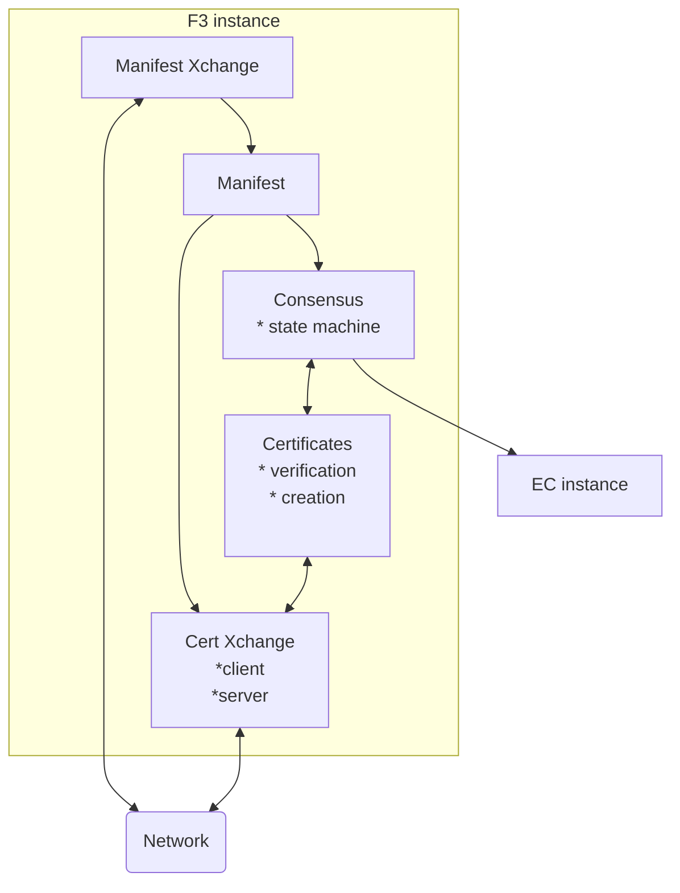

# rust-f3

========
Rust F3 implementation.

## Rust-F3 structure and architecture.

[FIP-0086](https://github.com/filecoin-project/FIPs/blob/master/FIPS/fip-0086.md)

### Rough diagram

### GPBFT consensus primitives and logic.
Pretty much all the other modules of the fast-finality gadget depend on this one. It defines:
* Participation primitives and logic
* Common interfaces and APIs, such as:
    * Consensus message validator
    * Signature verifier
    * Telemetry metrics
    * etc
* Consensus statemachine.

### Manifest
F3 configuration

#### Dynamic manifest
* allows changing f3 configuration at runtime
* updates sent via libp2p

### Certificate exchange and verification
A crucial part of fast-finality that allows for quick finalization of chain prefixes.

#### Client
This is the first step needed to be able to follow F3 consensus without active participation.

* Allows for requesting finality certificates
* Implements certificate verification logic

#### Server

A libp2p certificate exchange server.
1. fetches requested powertables from storage
2. fetches requested certs from storage
3. marshals that into CBOR
4. sends the response over the network

### f3 server
Where it all comes together
* runs the consensus instance + libp2p exchange
* runs the certificate exchange client/server via libp2p
* manifest provider - f3 config updates via libp2p

### FAQ
1. What is a finality certificate?
   * A certificate that proves that a given chain prefix is final. It must be signed by a super-majority
   of a power table.
